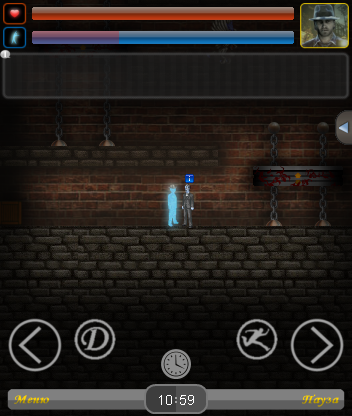

# 2DPlatformerMobileBasic
2D platformer game for Mobile Basic (j2me)

Информация
------------
Игра написана на языке Mobile Basic. Эта игра предназначена для j2me мобильных устройств.
Открывается на компьютере через Kemulator. Для более удобного тестирования нужно изначально запустить Kemulator и во вкладке View / Option изменить размеры экрана на 352х416 - один из стандартных экранов Nokia.
